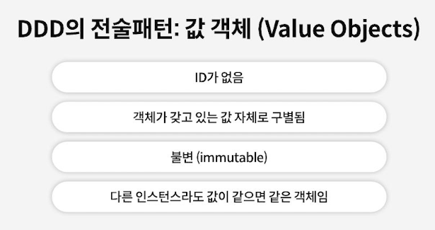

# Value Objects (VO) 값 객체

## Value Object 이란? &#x20;

<figure><figcaption></figcaption></figure>

<figure><figcaption></figcaption></figure>

## Value Object 을 사용하면 좋은점 &#x20;

<figure><figcaption></figcaption></figure>

## 코틀린에서는  Inline class 사&#x20;

<figure><figcaption></figcaption></figure>

